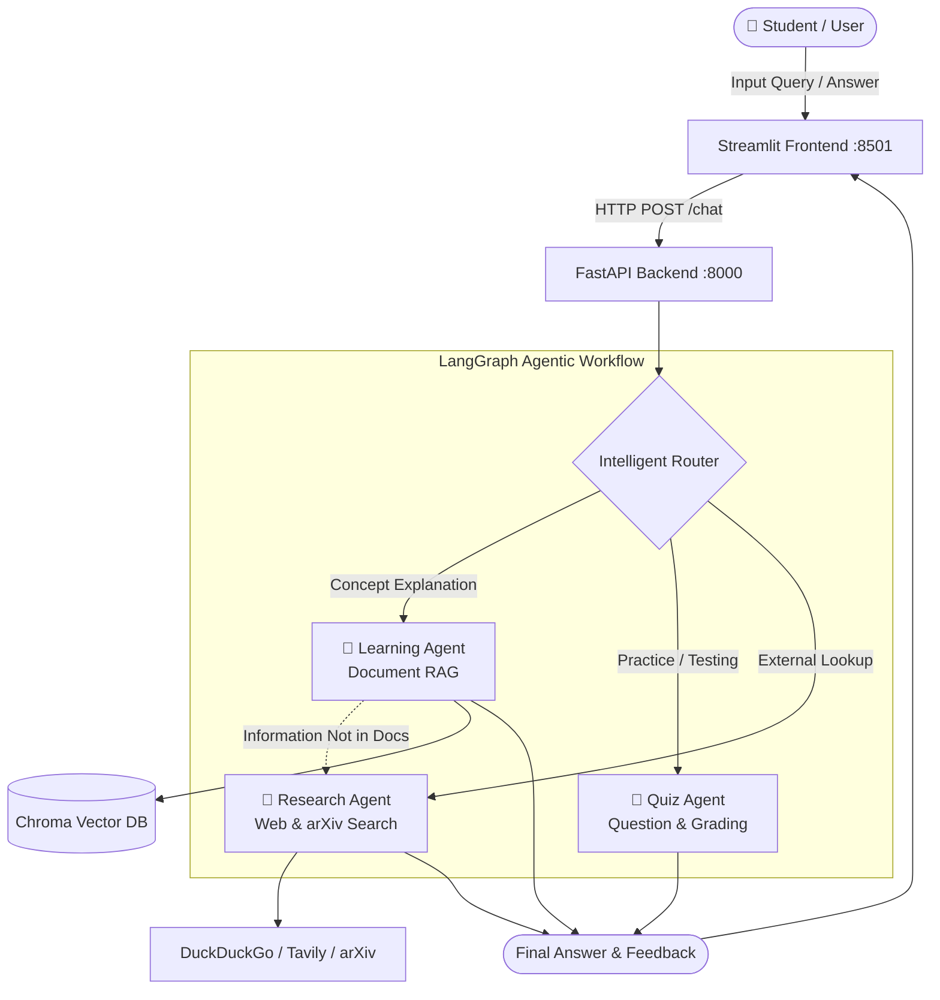

# 🧠 Agentic Personal Learning Assistant

[](https://www.python.org/)
[](https://fastapi.tiangolo.com/)
[](https://streamlit.io/)
[](https://langchain-ai.github.io/langgraph/)
[](https://groq.com/)
[](https://opensource.org/licenses/MIT)

An intelligent, multi-agent personal learning companion powered by **LangGraph**, **Groq LLMs**, **ChromaDB (RAG)**, **FastAPI**, and **Streamlit**. 

Upload your study materials (PDF, DOCX, TXT), ask conceptual questions, test yourself with interactive quizzes, and perform web/academic research when your local notes don't have the answer.

---

## ✨ Features

- **🧠 Multi-Agent Architecture (LangGraph)**:
  - **Learning Agent**: Delivers structured explanations, summaries, and real-world examples grounded strictly in your uploaded course materials.
  - **Quiz Agent**: Generates contextual practice questions from your notes and grades student answers with constructive feedback.
  - **Research Agent**: Falls back to external web search (**Tavily** / **DuckDuckGo**) and academic paper discovery (**arXiv**) for advanced concepts outside local notes.
  - **Router Node**: Intelligently categorizes intent and orchestrates multi-agent delegation.
- **📂 Document Ingestion & RAG**:
  - Ingest PDF, TXT, and DOCX documents with automated chunking via `RecursiveCharacterTextSplitter`.
  - Dense embeddings generated locally using `sentence-transformers/all-MiniLM-L6-v2` and stored in `ChromaDB`.
- **🎨 Modern Dark-Themed UI**:
  - Sleek glassmorphism interface built with Streamlit and custom CSS.
  - Real-time agent route badges (`🧠 Learning`, `📝 Quiz`, `🔬 Research`).
  - Sidebar for document upload, index inspection, and topic configuration.
- **🚀 Cloud Ready**:
  - Fully configured for cloud deployment via `render.yaml` (Render.com Blueprint).

---

## 🏛️ System Architecture



---

## 📁 Project Structure

```text
agentic-personal-learning-assistant/
├── agents/
│   ├── learning_agent.py      # Grounded RAG teaching agent
│   ├── quiz_agent.py          # Practice question generator & grader
│   └── research_agent.py      # Web and arXiv academic search agent
├── services/
│   ├── rag_service.py         # Document parsing, chunking & vector search
│   └── search_service.py      # DuckDuckGo, Tavily, and arXiv search wrapper
├── app.py                     # Streamlit frontend application
├── main.py                    # FastAPI REST backend server
├── workflow.py                # LangGraph state graph & router definition
├── state.py                   # TypedDict state schema across agents
├── render.yaml                # Infrastructure-as-code deployment blueprint
├── requirements.txt           # Python package dependencies
├── pyproject.toml             # Project build configuration
└── .env.example               # Environment variables template
```

---

## 🚀 Quick Start

### 1. Prerequisites
- Python 3.10+ (Recommended: Python 3.11 or 3.12)
- [Groq API Key](https://console.groq.com/keys) (free, ultra-fast LLM inference)
- *(Optional)* [Tavily API Key](https://app.tavily.com/) for enhanced research search

### 2. Clone the Repository
```bash
git clone https://github.com/RGSapp/agentic-personal-learning-assistant.git
cd agentic-personal-learning-assistant
```

### 3. Create & Activate Virtual Environment
```bash
python -m venv .venv

# On Windows:
.venv\Scripts\activate

# On macOS/Linux:
source .venv/bin/activate
```

### 4. Install Dependencies
```bash
pip install -r requirements.txt
```

### 5. Configure Environment Variables
Copy the `.env.example` file to `.env`:
```bash
cp .env.example .env
```

Edit `.env` and fill in your keys:
```ini
# Required: Groq API Key
GROQ_API_KEY=gsk_your_actual_groq_api_key

# Optional: Default model (defaults to openai/gpt-oss-120b)
GROQ_MODEL=openai/gpt-oss-120b

# Optional: Tavily API Key (falls back to DuckDuckGo if omitted)
TAVILY_API_KEY=your_tavily_api_key
```

---

## 🖥️ Running Locally

Run both the FastAPI backend and the Streamlit frontend in separate terminals:

### Terminal 1: Start FastAPI Backend
```bash
uvicorn main:app --reload --host 127.0.0.1 --port 8000
```
*API docs available at [http://127.0.0.1:8000/docs](http://127.0.0.1:8000/docs)*

### Terminal 2: Start Streamlit Frontend
```bash
streamlit run app.py --server.port 8501
```
*Open your browser at [http://localhost:8501](http://localhost:8501)*

---

## 🌐 One-Click Cloud Deployment (Render)

This repository includes a [`render.yaml`](render.yaml) blueprint that deploys both the FastAPI API and Streamlit UI services together.

1. Fork or push this repository to your **GitHub** account.
2. Sign up / log in to [Render.com](https://render.com).
3. Click **New +** → **Blueprint**.
4. Connect and select `agentic-personal-learning-assistant`.
5. Provide your `GROQ_API_KEY` under the environment variables prompt.
6. Click **Apply / Deploy**.

Render will automatically provision both services and link them together!

---

## 🛠️ Tech Stack & Libraries

- **Orchestration**: [LangGraph](https://github.com/langchain-ai/langgraph), [LangChain](https://github.com/langchain-ai/langchain)
- **Inference**: [ChatGroq](https://python.langchain.com/docs/integrations/chat/groq/)
- **Embeddings & Vector DB**: [Sentence-Transformers](https://sbert.net/), [ChromaDB](https://www.trychroma.com/)
- **Backend**: [FastAPI](https://fastapi.tiangolo.com/), [Uvicorn](https://www.uvicorn.org/)
- **Frontend**: [Streamlit](https://streamlit.io/)
- **Search Integrations**: [DuckDuckGo Search](https://duckduckgo.com/), [Tavily](https://tavily.com/), [arXiv](https://arxiv.org/)

---

## 📄 License

Distributed under the MIT License. See [LICENSE](LICENSE) for details.
